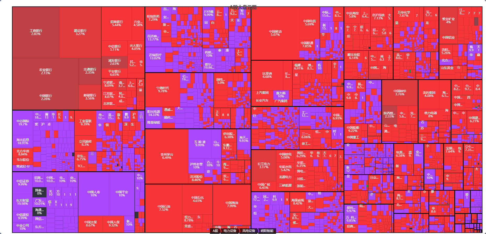
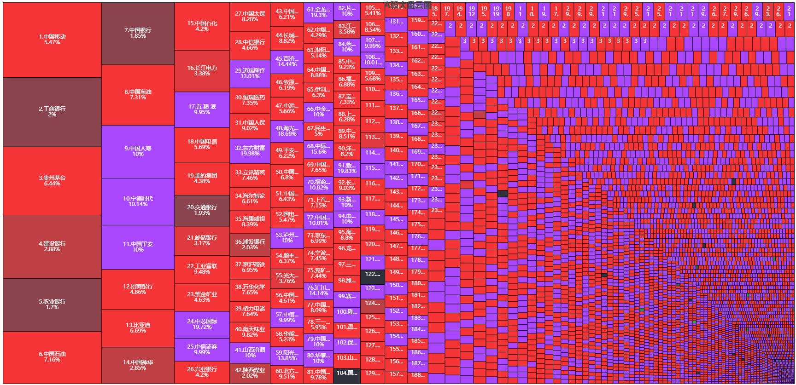
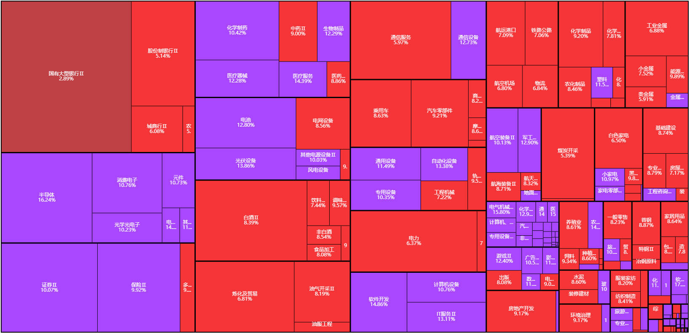

# A股大盘云图

## 2024年9月30日 万紫千红的大A

[](./img/1.jpg)

[大盘板块分类云图](https://47sang.github.io/) 

- 以树形图方式展示A股市场数据
- 按板块分类展示股票
- 通过颜色区分涨跌幅度
- 显示每个股票的市值、当前价格和涨跌幅

[](./img/2.jpg)

[市值大小排序云图](https://47sang.github.io/sort) 

- 按市值大小排序展示股票数据
- 包含序号、名称和涨跌幅信息
- 同样使用颜色区分涨跌状态

[](./img/3.jpg)

[板块涨跌幅云图](https://47sang.github.io/section) 

- 展示二级板块的市场数据
- 显示板块总市值、涨跌额和涨跌幅
- 同样采用树形图方式可视化

[](./img/4.jpg)

[二级板块正负条形图](https://47sang.github.io/sectionBar) 

- 使用条形图展示板块数据
- 对比显示当前市值、昨日市值和涨跌额
- 支持详细的数据标签显示

# 数据业务流程

- 先获取申万板块信息,个股所属的一二级分类,存入a_sw
- 提取申万板块字典存到a_sw_dict表中
- 获取个股数据,匹配板块信息,放到信息a_info表中
- 前端获取个股数据,数据清洗后存入a_today表中,按照天进行新增替换数据
- 返回前端数据前,将今天的接口数据结果存入a_data_json表中,用来缓存数据
- 如果在开盘时间,数据更新频繁,需要添加时间判断是否更新数据,收盘和周末的时间没有必要更新数据,从数据库读取缓存的数据即可

# 项目概述

## 项目简介

- A股大盘云图是一个基于Spring Boot和Rust的(开发中)股票数据可视化项目，旨在提供A股市场的实时数据分析和可视化展示。该项目通过调用第三方API获取股票信息，并将其整理成易于理解的图表和数据结构，帮助用户快速了解市场动态。

## 技术栈
- **后端**: Java, Spring Boot, MyBatis, Rust
- **前端**: HTML, JavaScript, ECharts, jQuery
- **数据库**: MySQL
- **其他**: Maven, Git

## 功能模块

### 1. 数据获取与处理
- **股票基础信息**: 从东方财富API获取A股的实时股票数据，包括最新价格、涨跌幅、成交量等信息。
- **数据缓存**: 将获取的数据存储在数据库中，以便后续快速访问和分析。

### 2. 数据可视化

- 使用ECharts图表库进行数据可视化
- 支持交互式操作(提示框、缩放等)
- 采用响应式设计，支持窗口大小调整
- 涨跌颜色映射
- 这个项目为投资者提供了直观的市场概览，帮助他们更好地理解市场结构和变化趋势。通过不同的可视化方式，使用户能够从多个维度分析市场数据

- **大盘云图**: 通过ECharts展示A股市场的整体情况，包括各个板块的市值、涨跌幅等信息。
- **二级板块云图**: 展示各个二级板块的详细信息，帮助用户了解不同板块的表现。
- **市值排序**: 提供按市值排序的股票信息，方便用户快速找到市值较大的股票。
- **正负条形图**: 展示二级板块的涨跌情况，帮助用户了解不同板块的表现。

### 3. 定时任务
- **数据刷新**: 定时从API获取最新的股票数据，并更新数据库中的信息，确保数据的实时性。
- **节假日判断**: 自动判断当前日期是否为节假日，避免在节假日进行数据更新。

### 4. API接口
- 提供RESTful API接口，供前端调用，获取股票信息、板块信息等数据。
- 接口包括：
  - `/info/all`: 获取所有股票的基础信息
  - `/info/sort`: 获取按市值排序的股票信息
  - `/info/section`: 获取板块涨跌信息
  - `/info/sectionBar`: 获取二级板块的条形图数据

## 项目结构
```
├── src
│   ├── main
│   │   ├── java
│   │   │   └── com
│   │   │       └── galigeigei
│   │   │           └── acloudmap
│   │   │               ├── controller
│   │   │               ├── entity
│   │   │               ├── service
│   │   │               ├── task
│   │   │               └── AcloudmapApplication.java
│   │   └── resources
│   │       ├── static
│   │       └── application.yaml
│   └── test
│       └── java
│           └── com
│               └── galigeigei
│                   └── acloudmap
└── rustcode
    ├── src
    │   ├── handlers
    │   ├── models
    │   ├── services
    │   └── task
```

## 如何运行
1. 确保已安装Java和Maven。
2. 配置数据库连接信息。
3. 使用Maven构建项目：
  ```bash
  mvn package -Dmaven.test.skip=true
  ```
4. 运行项目：
  ```bash
  java -jar target/acloudmap-1.0.jar
  ```

# 技术支持联系方式

- QQ:568261517
- 微信:prodzhou