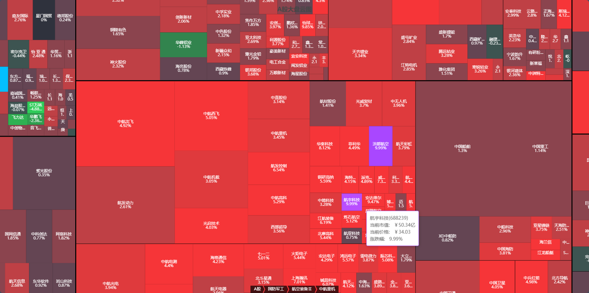
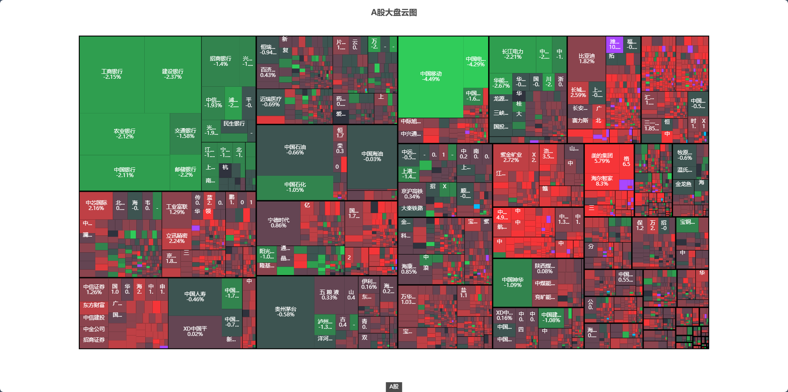

# A股大盘云图

# 数据业务流程

- 先获取申万板块信息,个股所属的一二级分类,存入a_sw
- 提取申万板块字典存到a_sw_dict表中
- 获取个股数据,匹配板块信息,放到信息a_info表中
- 前端获取个股数据,数据清洗后存入a_today表中,按照天进行新增替换数据
- 返回前端数据前,将今天的接口数据结果存入a_data_json表中,用来缓存数据
- 如果在开盘时间,数据更新频繁,需要添加时间判断是否更新数据,收盘和周末的时间没有必要更新数据,从数据库读取缓存的数据即可